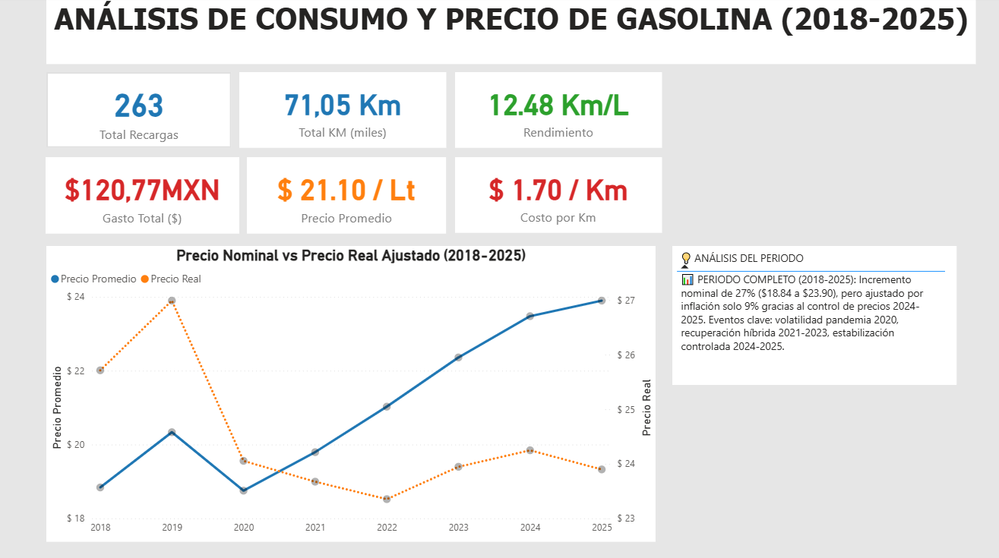

# Fuel Consumption Analysis with Power BI

## Project Overview

This project presents a fuel consumption and gasoline price analysis developed using personal vehicle fueling records.

The analysis was built in Power BI to identify consumption patterns, fuel efficiency trends, gasoline price variations, and annual fuel expenses.

---

## Objectives

- Analyze fuel consumption behavior over time
- Identify gasoline price increases
- Measure vehicle fuel efficiency
- Track annual fuel expenses
- Create interactive dashboards for data storytelling

---

## Tools & Technologies

- Power BI
- Power Query
- DAX
- Python
- Google Colab

---

## Key Metrics

- Total fuel expenses
- Average fuel efficiency
- Fuel price trend
- Annual consumption analysis

---

## Dashboard Preview

---

## Files Included

- `.pbix` Power BI dashboard
- Dashboard screenshots
- Future Python notebooks and datasets

---

## Author

Alejandro Estrada

Data Analyst | Power BI | Python | Energy & Fuel Consumption Analytics
